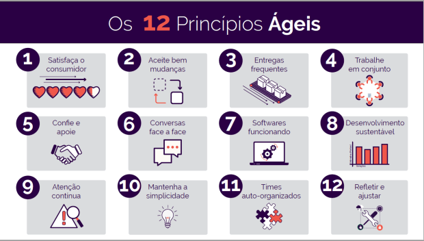

# Princípios Ágeis

## O que são esses princípios?

````
Eles correspondem a um conjunto de fundamentos que representam um complemento dos valores e reforçam a importância da comunicação e da satisfação dos envolvidos. Além disso, também destacam a entrega contínua em um ritmo saudável e a funcionalidade do software ou produto.

Tudo isso, sempre priorizando pessoas e soluções em detrimento dos processos burocráticos do modelo tradicional de gestão de projetos.
````
## Os Doze Princípios do Manifesto Ágil
### 1 – Geração de valor:

> “Nossa maior prioridade é satisfazer o cliente, através da entrega adiantada e contínua de software de valor.”
### 2- Flexibilidade:

> “Aceitar mudanças de requisitos, mesmo no fim do desenvolvimento. Processos ágeis se adequam a mudanças, para que o cliente possa tirar vantagens competitivas.”
### 3- Frequência:

> “Entregar o software em funcionamento com frequência, seja na escala de semanas ou meses, dando preferência a períodos mais curtos.”
### 4- União:

> “Tanto pessoas relacionadas a negócios como desenvolvedores devem trabalhar em conjunto, diariamente, durante todo o curso do projeto”.
### 5: Motivação:

> “Construir projetos em torno de indivíduos motivados, dando a eles o ambiente e o suporte necessário e confiando neles para fazer o trabalho.”
### 6: Comunicação:

> “O método mais eficiente e eficaz de transmitir informações para e entre uma equipe de desenvolvimento é por meio de conversa face a face”
### 7- Funcionalidade:

> “Software funcionando é a medida primária de progresso.”
### 8- Sustentabilidade:

> “Os processos ágeis promovem desenvolvimento sustentável. Os patrocinadores, desenvolvedores e usuários devem ser capazes de manter um ritmo constante indefinidamente.”
> ### 9- Revisão:

> “Contínua atenção à excelência técnica e bom design, aumenta a agilidade.”
### 10- Simplicidade:

> “A arte de maximizar a quantidade de trabalho que não precisou ser feito.”
### 11- Organização:

> “As melhores arquiteturas, requisitos e designs emergem de times auto-organizáveis.”
### 12- Autoavaliação:

> “Em intervalos regulares, o time reflete em como ficar mais efetivo, então, se ajustam e otimizam seu comportamento de acordo”

## 
O começo de uma nova era

Podemos dizer que o Manifesto representou um grito de liberdade, dando fim a práticas e burocracias que travavam o processo de desenvolvimento. Depois de sua criação, no final do mesmo ano (2001), surgiu a Agile Alliance, a organização sem fins lucrativos responsável por compartilhar esse conhecimento em todo o mundo.

As Metodologias Ágeis vieram para ficar e por isso não devem ficar em segredo. Por meio de debates, discussões e estudos todos podem propor novas ideias que sigam esses princípios e promover inovação com geração de valor.

Ficou claro para você por que trabalhamos com essas Metodologias? O uso de frameworks como o Scrum, Kanban, Lean e muitos outros, ajudam a tornar o sucesso de nossos clientes e parceiros possível.

Se tiver alguma dúvida, pode enviar. Nós ajudamos você a entender melhor!

